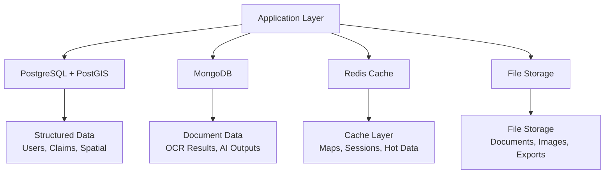
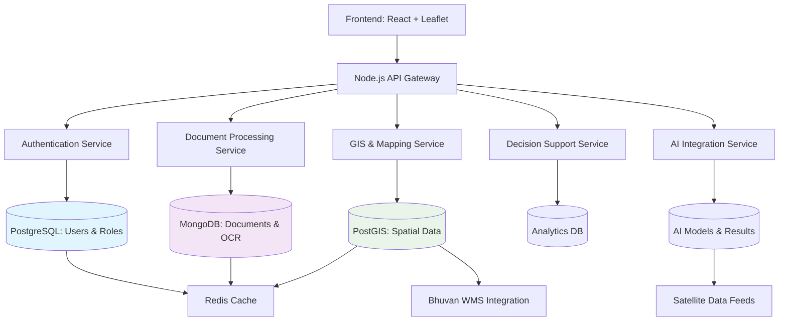
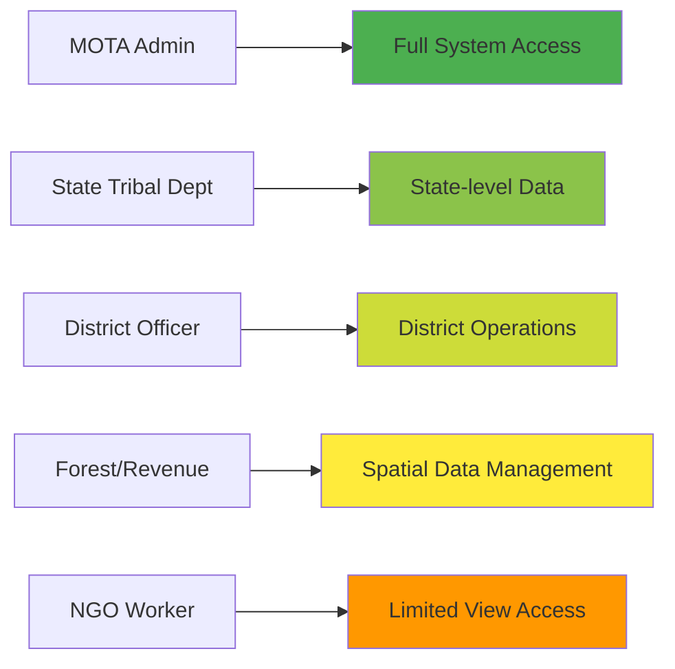
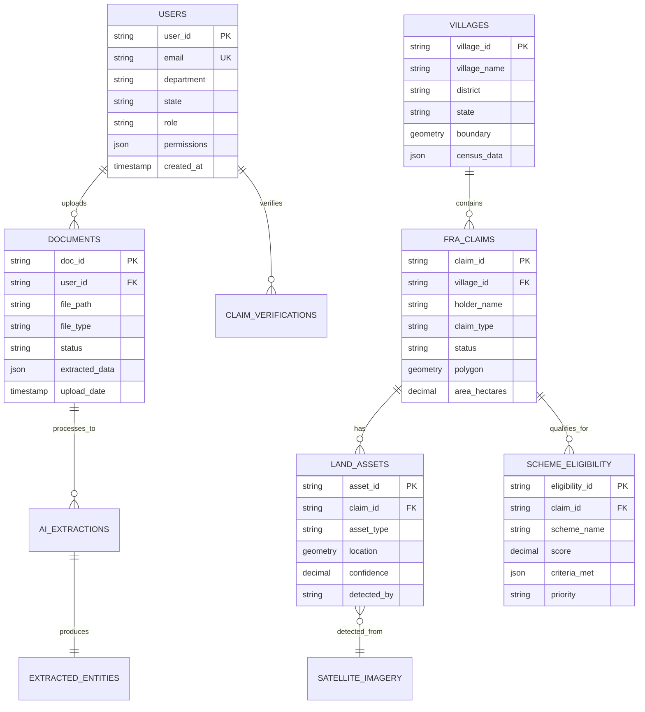
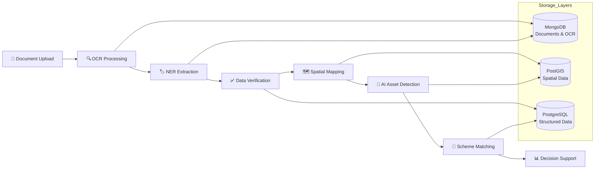
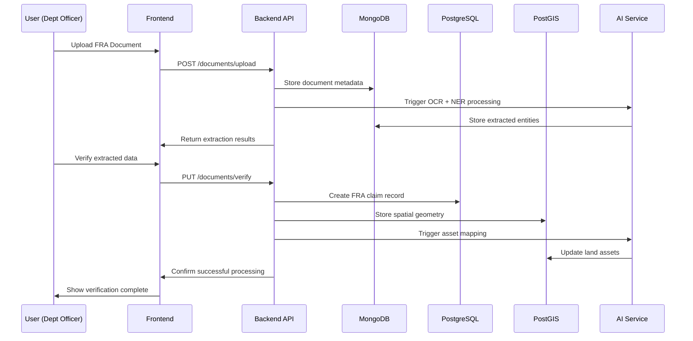
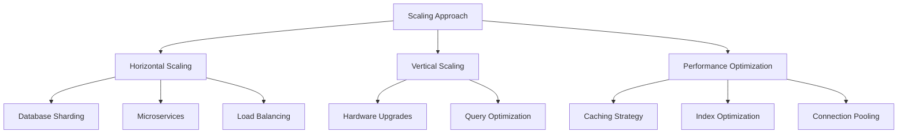

# 🗃️ FRA Management System - Database Organization

## 📋 Table of Contents
- [Overview](#overview)
- [Design Goals](#design-goals)
- [Data Management Approach](#data-management-approach)
- [High-Level Architecture](#high-level-architecture)
- [Core Entities](#core-entities)
- [Entity Relationship Model](#entity-relationship-model)
- [Data Flow Lifecycle](#data-flow-lifecycle)
- [Access & Storage Strategy](#access--storage-strategy)
- [Scalability and Maintenance](#scalability-and-maintenance)
- [Performance Optimization](#performance-optimization)
- [Summary](#summary)

---

## Overview <a name="overview"></a> 🌐

The **Database Organization** defines how all critical information—ranging from FRA documents and geospatial data to AI-processed results—is structured, interlinked, and accessed across the FRA Management System.  

We've designed a **logical, flexible, and scalable data model** that supports document processing, spatial analysis, AI integration, and decision support while maintaining data integrity and security.

> ⚡ **Implementation Ready:** This architecture is designed for immediate development with clear migration paths for future enhancements.

---

## Design Goals <a name="design-goals"></a>

| Goal | Description | Implementation Approach |
|------|-------------|------------------------|
| **Modularity** | Each data domain is self-contained but interoperable | Separate databases for documents, spatial data, users |
| **Scalability** | Handle millions of documents and spatial features | Cloud-native design with horizontal scaling |
| **Flexibility** | Support new entity types (IoT, new AI layers) | Schema-less document storage + structured relational data |
| **Traceability** | Every action linked to verified user and timestamp | Comprehensive audit logging and version control |
| **Performance** | Fast spatial, text, and relational queries | Strategic indexing and caching layers |

---

## Data Management Approach <a name="data-management-approach"></a> 🧠

### Multi-Database Strategy



| Layer | Purpose | Storage Technology | Data Examples |
|-------|---------|-------------------|---------------|
| **Structured Data** | Users, roles, spatial relationships, claims | PostgreSQL + PostGIS | User profiles, land parcels, village boundaries |
| **Document Data** | OCR text, AI/NER outputs, processing metadata | MongoDB | Extracted text, model confidence scores, version history |
| **Spatial Data** | Geographic features, maps, asset locations | PostGIS | FRA parcels, water bodies, forest cover polygons |
| **Cache Layer** | Frequently accessed data, session management | Redis | Map tiles, user sessions, hot queries |
| **File Storage** | Raw documents, images, export files | Cloud Storage | Scanned FRA documents, satellite imagery, reports |

---

## High-Level Architecture <a name="high-level-architecture"></a> 🏗️



> 🎯 **Architecture Benefits:**
> - **Microservices Ready:** Each service can scale independently
> - **Data Isolation:** Sensitive user data separated from document processing
> - **AI Integration:** Clean interfaces for machine learning pipelines
> - **Real-time Capable:** WebSocket support for live updates

---

## Core Entities <a name="core-entities"></a> 🔑

### Primary Data Entities

| Entity | Description | Key Fields | Storage |
|--------|-------------|------------|---------|
| **User** | System stakeholders and officials | `user_id, role, department, state, permissions` | PostgreSQL |
| **Document** | FRA files for OCR processing | `doc_id, file_path, status, upload_date, extracted_data` | MongoDB |
| **FRA Claim** | Individual/Community land claims | `claim_id, holder_name, village, status, geometry` | PostGIS |
| **Village** | Geographic boundary and metadata | `village_id, name, district, population, geometry` | PostGIS |
| **Asset** | AI-detected features (water, forests) | `asset_id, type, coordinates, confidence, source` | PostGIS + MongoDB |
| **AI Result** | OCR, NER, classification outputs | `result_id, model_name, confidence, input_data, output_data` | MongoDB |
| **Scheme** | Government scheme eligibility | `scheme_id, name, criteria, priority, benefits` | PostgreSQL |

### User Roles & Data Access Matrix



| Role | Document Upload | Map Layers | Decision Support | Admin Features |
|------|----------------|------------|-----------------|---------------|
| **MOTA Admin** | ✅ Full Access | ✅ All Layers | ✅ Full Analytics | ✅ User Management |
| **State Tribal Dept** | ✅ State Level | ✅ State Layers | ✅ State Analytics | ⚠️ Limited |
| **District Officer** | ✅ District Level | ✅ District Layers | ✅ District Insights | ❌ None |
| **Forest/Revenue Dept** | ⚠️ Limited | ✅ Spatial Data | ✅ Environmental Data | ❌ None |
| **NGO Worker** | ❌ None | ✅ Basic View | ❌ None | ❌ None |

---

## Entity Relationship Model <a name="entity-relationship-model"></a> 🧩



> 🔗 **Relationship Highlights:**
> - **User-Centric:** All actions traceable to specific users
> - **Document Flow:** Clear pipeline from upload → OCR → verification → spatial mapping
> - **Spatial Integration:** Geographic relationships maintained in PostGIS
> - **AI Ready:** Structured storage for model inputs and outputs

---

## Data Flow Lifecycle <a name="data-flow-lifecycle"></a> 🔄

### Complete Document-to-Decision Pipeline



### Detailed Sequence Flow



---

## Access & Storage Strategy <a name="access--storage-strategy"></a> 🧭

### Role-Based Access Control (RBAC)

```javascript
// Example Permission Structure
{
  user: {
    id: "USR_MP_001",
    role: "STATE_OFFICER",
    department: "Tribal Welfare",
    state: "Madhya Pradesh",
    permissions: {
      documents: ["upload", "view", "verify"],
      maps: ["view_state", "filter_district"],
      analytics: ["view_state_reports"],
      users: ["view_team"]
    }
  }
}
```

### Data Partitioning Strategy

| Partition Type | Criteria | Benefit |
|---------------|----------|---------|
| **Geographic** | By State (MP, Odisha, etc.) | Faster spatial queries, localized management |
| **Temporal** | By upload year/month | Efficient archives and backups |
| **Departmental** | By user department | Data isolation and security |

---

## Scalability and Maintenance <a name="scalability-and-maintenance"></a> ⚙️

### Scaling Strategies



### Maintenance Operations

| Operation | Frequency | Automation | Recovery Time |
|-----------|-----------|------------|---------------|
| **Backups** | Daily (incremental) + Weekly (full) | ✅ Automated scripts | 2-4 hours |
| **Index Rebuild** | Monthly | ✅ Scheduled jobs | During maintenance window |
| **Data Archiving** | Quarterly | ✅ Automated | N/A |
| **Performance Review** | Monthly | ⚠️ Manual + Automated alerts | N/A |

---

## Performance Optimization <a name="performance-optimization"></a> 🚀

### Indexing Strategy

```sql
-- Spatial indexes for GIS queries
CREATE INDEX idx_fra_parcels_geom ON fra_parcels USING GIST(geometry);
CREATE INDEX idx_village_boundaries_geom ON village_boundaries USING GIST(geometry);

-- Performance indexes for common queries
CREATE INDEX idx_fra_data_state_district ON extracted_fra_data(state, district);
CREATE INDEX idx_users_department_state ON users(department, state);
CREATE INDEX idx_documents_status_date ON fra_documents(status, upload_date);
CREATE INDEX idx_assets_village_type ON asset_mapping(village_id, asset_type);
```

### Caching Strategy

| Cache Type | Data Cached | TTL | Technology |
|------------|-------------|-----|------------|
| **Session Cache** | User sessions, permissions | 24 hours | Redis |
| **Map Tile Cache** | Rendered map tiles, WMS responses | 1 week | Redis + CDN |
| **Query Cache** | Frequent spatial queries, analytics | 1 hour | Redis |
| **Document Cache** | Recently processed documents | 4 hours | Redis |

---

## Summary <a name="summary"></a> 🎯

### 🏆 Key Architecture Achievements

| Aspect | Achievement | Impact |
|--------|-------------|--------|
| **Data Model** | Hybrid relational + document + spatial | Best tool for each data type |
| **Scalability** | Cloud-native with horizontal scaling | Ready for national deployment |
| **Security** | RBAC with comprehensive audit trails | Meets government security standards |
| **AI Integration** | Structured pipelines for model outputs | Future-proof for new AI capabilities |
| **Performance** | Strategic indexing and caching | Responsive user experience |

### 🚀 Implementation Readiness


**Phase 1 Deliverables:**
- ✅ PostgreSQL + PostGIS database setup
- ✅ MongoDB document store configuration  
- ✅ User management and RBAC system
- ✅ Basic document upload and storage

**Future Enhancements:**
- 🔄 Real-time satellite data integration
- 🔄 IoT sensor data streams
- 🔄 Advanced AI/ML model serving
- 🔄 Mobile data collection interfaces

---

## 📞 Database Support & Contacts

**State Coordination:**
- Madhya Pradesh: `dirtadp@mp.gov.in`
- Odisha: `stscdev@gmail.com`
- Tripura: `twdtripura@gmail.com`
- Telangana: `secretary_tw@telangana.gov.in`

> 📋 **Note:** This database organization provides a **production-ready foundation** that balances flexibility with structure, enabling rapid development while maintaining data integrity and security across all FRA management operations.

---

<div align="center">

**🏛️ Ministry of Tribal Affairs**  
**🌳 Forest Rights Act Management System**  
**📅 Database Architecture Document**

</div>
