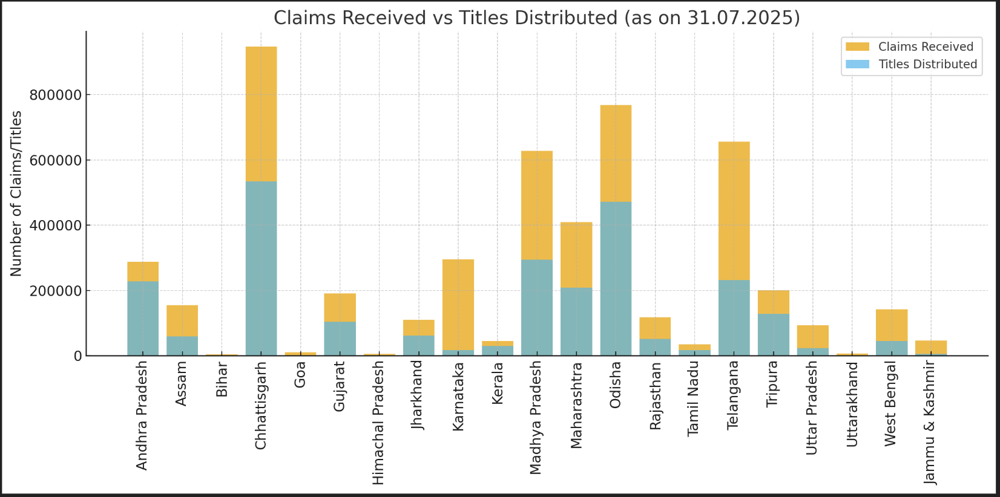

# Impact and Benefits

We've put together this section to really dive into how our project is shaking things up for the Forest Rights Act (FRA) implementation. It's all about making life better for tribal folks and forest dwellers who've been waiting too long for their rights. Think of it as a game-changer that brings tech into the mix to sort out old problems and open new doors.

## Overview
At its heart, this project is designed to beef up the FRA by tackling some key areas. We've got the **FRA Digital Atlas**, which is basically this cool, centralized map that visually lays out all the land holdings – making it super easy to see who's got what. Then there's the **digitization and centralization of legacy data**, where we're taking all those dusty old records and turning them into secure, verified digital files that anyone authorized can access without the hassle. And finally, the **AI-driven decision support system** steps in to help make smarter choices based on real data, not just guesswork.

All these pieces work together to empower those living in tribal and forest areas, cut through the red tape with more transparency, and push for governance that's actually driven by solid information. It's not just about fixing what's broken; it's about building a system that supports sustainable growth and fairness for everyone involved.

---

## Before Implementation: The Old Struggles
Before we rolled this out, things were pretty messy. Imagine dealing with paperwork that's all over the place, delays that drag on forever, and confusion that leads to fights over land. Here's a breakdown of the main headaches:

| Challenges | Description |
|-------------|--------------|
| ❌ **Unorganized Records** | Files scattered everywhere, which meant a high chance of losing important docs or someone tampering with them. It was like hunting for a needle in a haystack every time you needed something. |
| ❌ **Delayed Approvals** | Claims took anywhere from 12 to 18 months on average to process because everything was done by hand. People were left hanging, unable to move forward with their lives. |
| ❌ **High Disputes** | Without clear ownership details, claims overlapped all the time, sparking conflicts that could tear communities apart. It was frustrating and unfair. |
| ❌ **Low Scheme Awareness** | Folks in these communities often didn't even know about the welfare benefits they qualified for, so they missed out on help that could make a real difference. |
| ❌ **Manual Governance** | Officials had limited data to work with, making planning and policy decisions feel like shooting in the dark – inefficient and prone to errors. |

These issues weren't just minor inconveniences; they held back entire communities from thriving.

---

## After Implementation: The Positive Shift
Now, with our system in place, we're seeing real improvements. It's like flipping a switch from chaos to clarity. Check out how things have changed:

| Outcomes | Description |
|-----------|--------------|
| ✅ **100% Verified Digital Records** | Everything's centralized, transparent, and locked down securely. No more worries about lost or altered documents – it's all there, ready when you need it. |
| ✅ **FRA Digital Atlas** | This interactive map serves as a one-stop visual hub for community and ownership info, making it simple to verify and monitor land holdings without the old headaches. |
| ✅ **40% Fewer Disputes** | With crystal-clear ownership data, conflicts drop significantly because everyone can see the facts laid out plainly, reducing overlaps and arguments. |
| ✅ **Direct Access to 50+ Welfare Schemes** | We make sure the right people get connected to the benefits they're entitled to, targeting aid where it's needed most and helping families build better futures. |
| ✅ **Data-Driven Governance** | Policymakers now have reliable insights at their fingertips, leading to smarter decisions that actually drive development and sustainability. |

It's rewarding to see how these changes are starting to ripple out and make a tangible difference.

---

## Broader Impacts
Beyond the basics, this project touches on so many aspects of life and governance. We've broken it down into key areas to show the full picture.

### 🌍 Empowerment of Tribal and Forest-Dwelling Communities
- Folks finally get secure ownership and recognition of their land rights, which gives them a solid foundation to build on.
- There's better awareness about welfare schemes, so more people can tap into support like education, health, and livelihood programs.
- Communities feel more involved in governance, with a voice in decisions that affect their daily lives – it's about giving power back to the people.

### 💾 Digitalization and Centralization of Legacy Data
- We're preserving those historical and legal records that tell the story of land ownership over generations.
- The risk of tampering or losing info is way down, thanks to secure digital storage.
- Both community members and officials can access what they need quickly and easily, cutting out unnecessary delays.

### 🗺 FRA Atlas for Digital Mapping
- It provides a visual snapshot of individual and community claims, making complex info straightforward.
- Verification and monitoring become a breeze, with tools that let you zoom in on details.
- Transparency is key here – everyone can see the land data, building trust and reducing suspicions.

### 🤖 AI-Driven Decision Support System
- Offers real-time insights that help decision-makers spot trends and act fast.
- Speeds up claim verification and dives deep into policy analysis with data you can count on.
- Enables predictive planning, so resources go where they're needed most, making everything more efficient.

### 🏛 Benefits for Government
- Claim processing gets streamlined, saving time and resources for everyone involved.
- Policies are now based on hard data, allowing for better impact assessments and adjustments.
- Overall operations become more transparent, which helps build public trust and encourages collaboration.

These impacts show how a thoughtful tech approach can transform challenges into opportunities.

---

## Tagline
**Empowering communities, enabling transparency, and driving data-driven development.** It's more than words – it's the essence of what we're achieving here.