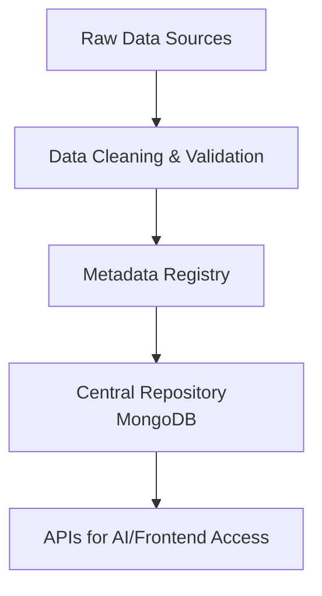
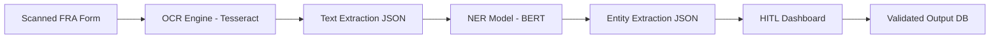
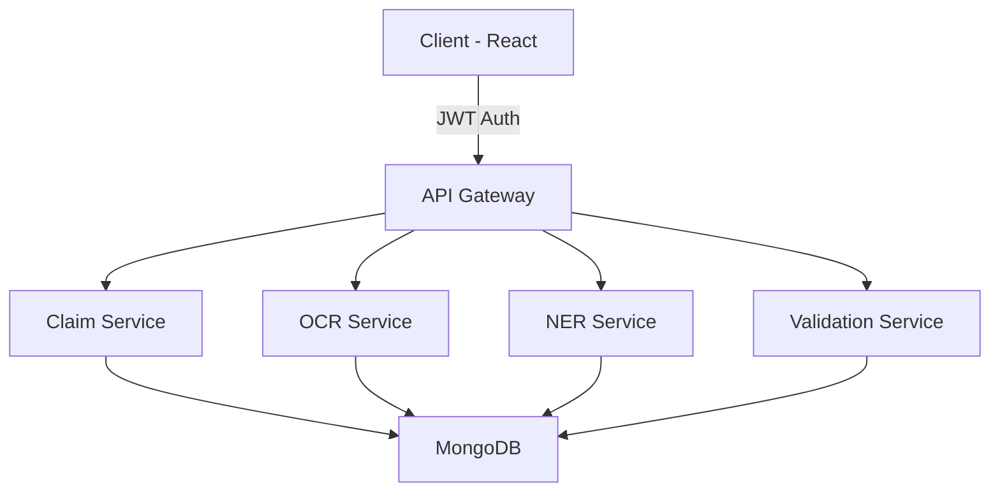
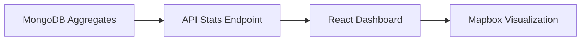
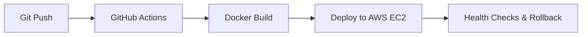
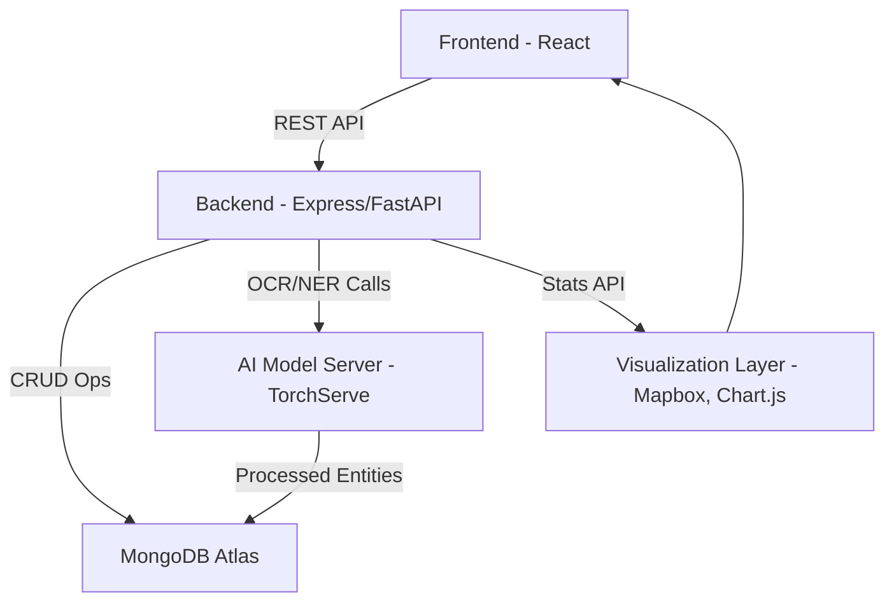

# 🧠 FRA_Digital_System_Implementation_Plan.md

## ⚙️ Phase 1: Setup & Governance
**Focus:** Repository setup, dataset baselining, metadata standards  
**Contributors:** Backend, Database, DevOps  

---

### 🏗️ Execution Steps

1. **Initialize Repository & Version Control**
   - Create GitHub/GitLab repository.
   - Set up project directories: `/backend`, `/frontend`, `/ai_model`, `/docs`.
   - Establish PR and branching policy (`main`, `dev`, `feature/*`).

2. **Baseline Dataset Preparation**
   - Collect & standardize Forest Rights Act (FRA) claim data.
   - Define consistent data schemas for claim, claimant, village, and agency entities.
   - Store raw datasets in `/data/raw/` with metadata JSONs.

3. **Metadata Standards**
   - Define naming conventions (`FRA_CLAIM_<STATE>_<ID>.json`).
   - Add validation rules for mandatory attributes.
   - Use Pydantic/JSON Schema validation in backend.

---

### 📂 Data Model Overview
| Entity | Description | Key Fields |
|--------|--------------|------------|
| `Claim` | Individual FRA claim record | `claim_id`, `applicant_id`, `village_code`, `status` |
| `Applicant` | Claimant information | `applicant_id`, `name`, `aadhaar_no`, `tribe_category` |
| `Village` | Geospatial and jurisdictional info | `village_code`, `district`, `lat`, `lon` |
| `Agency` | Institutional data | `agency_id`, `type`, `contact_email`, `jurisdiction` |

---

### 🧩 Architecture Diagram


---

## 🤖 Phase 2: AI Model Development
**Focus:** OCR + NER pipeline, model validation dashboard  
**Contributors:** AI Team, Backend Engineers  

---

### 🧱 Execution Steps
1. **OCR (Optical Character Recognition)**
   - Extract text from scanned FRA claim forms using **Tesseract + EasyOCR**.
   - Convert PDFs/images to structured text.
   - Store extracted text in `ocr_output` collection.

2. **NER (Named Entity Recognition)**
   - Train/fine-tune transformer-based model (BERT/DistilBERT) for entity tagging.
   - Extract entities: *Applicant Name*, *Survey No.*, *Village*, *Area Claimed*.
   - Output in JSON format linked to `claim_id`.

3. **HITL Validation Dashboard**
   - Build web dashboard (React + FastAPI) for Human-In-The-Loop validation.
   - Enable users to approve/reject OCR-NER extractions.
   - Save approved data back to `fra_cleaned` collection.

4. **Data Storage & Linking**
   - Store cleaned text, entity tags, and validation status.
   - Use MongoDB relations:  
     `Claim` → `OCR_Output` → `NER_Output` → `Validated_Data`

---

### 🧠 AI Pipeline Flow


---

## 🧩 Phase 3: Backend Integration & API Layer
**Focus:** API Gateway, Microservices, and Secure Access  
**Contributors:** Backend, DevOps  

---

### 🔌 Execution Steps
1. **Setup Express/FastAPI Backend**
   - Use RESTful design for modular endpoints.
   - Implement JWT-based authentication.
   - Folder structure:
     ```
     /api
       ├── /routes
       ├── /controllers
       ├── /models
       ├── /middleware
     ```

2. **Core API Endpoints**
   - `/api/claims/` → CRUD operations for claims.
   - `/api/ocr/` → OCR text fetch & upload.
   - `/api/ner/` → Entity extraction results.
   - `/api/validate/` → Approve/reject entities.
   - `/api/stats/` → Aggregated claim analytics.

3. **Security**
   - Implement token validation middleware.
   - Enable HTTPS for all endpoints.
   - Role-based access control: `admin`, `validator`, `viewer`.

---

### 🔐 API Architecture


---

## 🌐 Phase 4: Frontend & Data Visualization
**Focus:** Real-time dashboard, analytics, and map visualizations  
**Contributors:** Frontend, Backend  

---

### 🧭 Modules
1. **Dashboard**
   - Display claim statistics by state/district.
   - Show validation progress per batch.

2. **Validation Console**
   - Interface for human review of extracted data.
   - Highlight confidence scores from model.

3. **Geospatial Map**
   - Use Leaflet/Mapbox for visualizing village-wise claim distribution.

---

### 💡 Visualization Architecture


---

## 📦 Phase 5: CI/CD & Deployment
**Focus:** Automation, monitoring, and scaling  
**Contributors:** DevOps, Backend  

---

### ⚡ Deployment Stack
| Component | Tool/Platform |
|------------|---------------|
| **Version Control** | GitHub |
| **Backend** | FastAPI / Express |
| **AI Models** | TorchServe |
| **Database** | MongoDB Atlas |
| **Frontend** | React + Vite |
| **Deployment** | Docker + Nginx + AWS EC2 |
| **Monitoring** | Prometheus + Grafana |

---

### 🔄 CI/CD Pipeline


---

## 🧾 Implementation Timeline

| Phase | Description | Duration | Output |
|-------|--------------|-----------|---------|
| 1 | Setup & Governance | 2 Weeks | Repo, Metadata, Dataset |
| 2 | AI Model Development | 4 Weeks | OCR + NER + Dashboard |
| 3 | Backend Integration | 3 Weeks | APIs + Database Linkage |
| 4 | Frontend + Visualization | 3 Weeks | Dashboard + Map UI |
| 5 | CI/CD + Deployment | 2 Weeks | Live Cloud Deployment |

---

## 🧩 Developer Notes
- Use environment variables for all secrets (`.env`).
- Use JSON schema versioning for data consistency.
- Maintain unit & integration tests for each service.
- Always validate OCR/NER outputs before ingestion.

---

## ✅ Final Architecture Overview


---

### 🧰 Folder Structure (Final)
```
FRA_Digital_System/
├── backend/
│   ├── routes/
│   ├── models/
│   ├── controllers/
│   ├── middleware/
│   └── utils/
├── ai_model/
│   ├── ocr/
│   ├── ner/
│   └── hitl_dashboard/
├── frontend/
│   ├── src/
│   └── public/
├── data/
│   ├── raw/
│   ├── processed/
│   └── cleaned/
└── docs/
    └── FRA_Digital_System_Implementation_Plan.md
```
