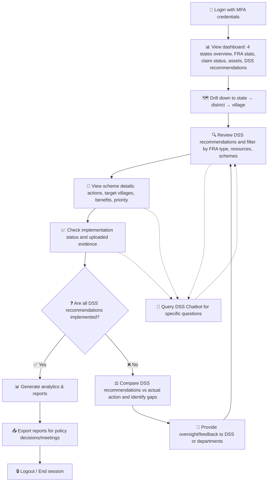
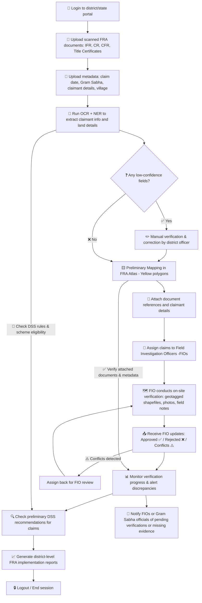
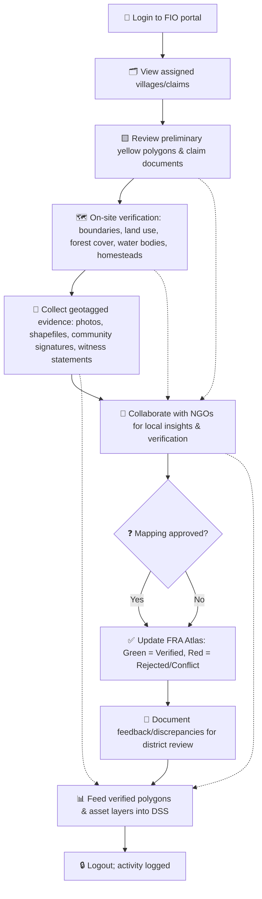
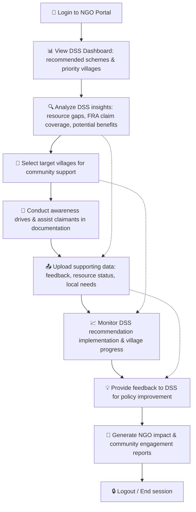
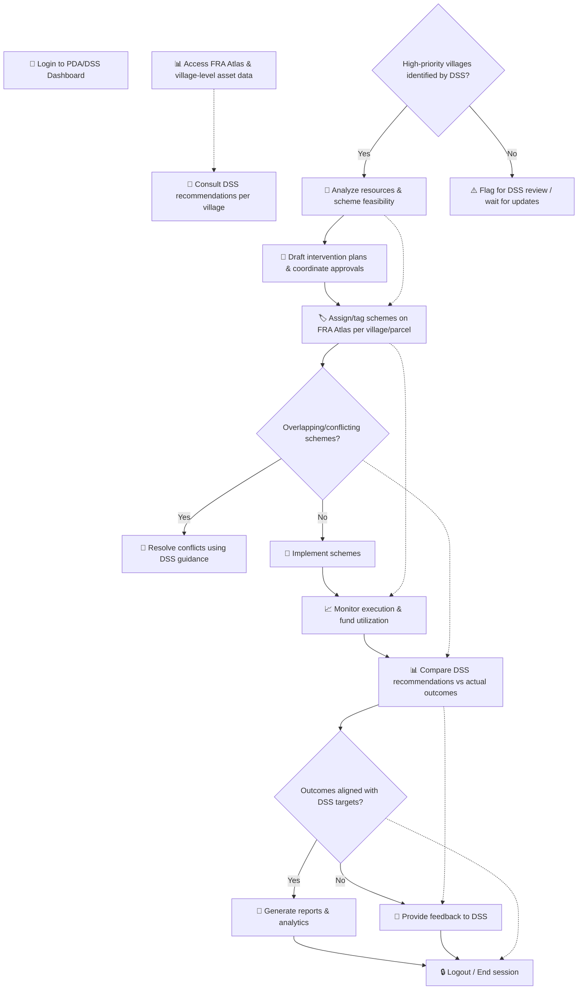

# 🗺️ FRA Atlas User Workflows

> Comprehensive guide to FRA Atlas workflows, decision support, and user collaboration

---

This document provides **detailed workflow diagrams** for all user types in the **FRA Atlas & DSS system**, including:

- How **Central Government, PDAs, District Departments, FIOs, and NGOs** collaborate.
- How the **Decision Support System (DSS)** guides **scheme planning, prioritization, and FRA implementation**.
- Step-by-step **task flows, responsibilities, and reporting mechanisms**.

⚡ **Key Highlights:**  
- Visualized workflows for each user type  
- Interactive DSS-driven decision pathways  
- Clear mapping of responsibilities and outputs  

---

## 🧭 Table of Contents  

1. [🌐 **Website Overview:** FRA Atlas & DSS System](#fra-atlas--dss-system-website-workflow)  
2. [🏛️ **Central Government (Ministry of Tribal Affairs)**](#1-central-government-ministry-of-tribal-affairs)  
3. [🏢 **District-Level Tribal Welfare & Line Departments (DAJGUA)**](#2-district-level-tribal-welfare-departments--line-departments-of-dajgua)  
4. [🧍‍♂️ **Field Investigation Officer (FIO)**](#3-field-investigation-officer-fio)  
5. [🤝 **NGOs Working with Tribal Communities**](#4-ngos-working-with-tribal-communities)  
6. [📈 **Planning & Development Authorities (PDA / DSS)**](#5-planning--development-authorities)  
7. [📚 **Appendix:** Tables, Legends & Cross-References](#appendix-tables-legends--cross-references)  

---

## FRA ATLAS & DSS SYSTEM WEBSITE WORKFLOW

## 🌍 Website Overview Summary

| 🌐 **Feature** | 🧩 **Description** | 👥 **Users Involved** | 🎯 **Key Outcome** |
|:----------------|:------------------|:----------------------|:-------------------|
| 🔑 **Login Portal** | Secure entry point for all user roles | All Users | Controlled and authorized access |
| 🗺️ **FRA Atlas Map** | Visual representation of verified FRA parcels and village-level assets | FIOs, Districts, PDAs | Verified FRA geospatial data |
| 🧠 **DSS Dashboard** | AI-driven decision support system for planning and prioritization | PDAs, Central Govt, NGOs | Data-informed policy and planning |
| 📊 **Reports & Analytics** | Visualization of progress, implementation, and DSS comparisons | Central Govt, PDAs | Transparency and monitoring |
| 🤝 **Collaboration Layer** | Seamless coordination between departments and users | All Stakeholders | Enhanced communication and workflow synergy |

```mermaid
flowchart TD
    %% PDA & DSS Portal Workflow
    A[🔑 Login to PDA Portal / DSS Dashboard] --> B[🗺️ Access verified FRA Atlas & village-level asset data]
    B --> C[📊 Analyze DSS recommendations: schemes, priorities, resource gaps]
    C --> D[🔍 Filter villages by need, FRA type, and existing interventions]
    D --> E[🎯 Select priority villages for scheme planning]
    E --> F[📝 Formulate development action plans using DSS insights]
    F --> G[🤝 Coordinate with District & Line Departments for approvals & resource allocation]
    G --> H[🏷️ Assign schemes to villages / tag parcels on FRA Atlas]
    H --> I[📈 Monitor scheme implementation and fund utilization]
    I --> J[📊 Compare DSS recommendations vs actual outcomes]
    J --> K[📑 Generate analytics, reports, & feedback to DSS]
    K --> L[🔒 Logout / End session]

    %% Central Govt
    CG[🏛️ Central Govt] -->|📡 Monitor progress| D[🏢 District Officials]
    CG -->|📤 Receive DSS reports| PDA[🏛️ Planning & Development Authorities]

    %% District Officials
    D1[🔑 Login to portal] --> D2[📂 Upload FRA docs: claims & title certificates]
    D2 --> D3[📝 Run OCR + NER to extract claimant & land data]
    D3 --> D4{❓ Low-confidence fields?}
    D4 -- Yes --> D5[✏️ Manual correction]
    D4 -- No --> D6[🗺️ Preliminary FRA Atlas mapping - yellow]
    D6 --> D7[📤 Assign claims to FIOs]
    D7 --> D8[📊 Monitor FIO progress & receive verification updates]

    %% Field Investigation Officers
    FIO1[🔑 FIO Login & view assigned claims] --> FIO2[📍 On-site verification]
    FIO2 --> FIO3[📸 Collect geotagged photos, shapefiles, evidence]
    FIO3 --> FIO4{✅ Claim valid?}
    FIO4 -- Yes --> FIO5[🟢 Approve mapping - Green in FRA Atlas]
    FIO4 -- No --> FIO6[🔴 Reject / mark conflict - Red]
    FIO5 & FIO6 --> FIO7[📝 Upload field notes & feedback]

    %% DSS & Planning Authorities
    PDA1[🔑 PDA Login & access verified FRA Atlas] --> PDA2[📊 Consult DSS recommendations]
    PDA2 --> PDA3[🎯 Prioritize villages & plan interventions]
    PDA3 --> PDA4[🤝 Coordinate with districts for approvals & resource allocation]
    PDA4 --> PDA5[📈 Monitor implementation & compare DSS vs actual outcomes]
    PDA5 --> PDA6[📑 Feedback to DSS & generate reports]
    PDA6 --> CG

    %% NGOs
    NGO1[🔑 NGO Login & access FRA Atlas + DSS] --> NGO2[🔍 Identify high-need villages]
    NGO2 --> NGO3[👐 Assist communities: awareness, documentation, scheme support]
    NGO3 --> NGO4[📤 Provide feedback & geotagged observations]
    NGO4 --> PDA2

    %% Connections
    D8 --> FIO1
    FIO7 --> PDA2
    FIO7 --> NGO1



```

## 1. Central Government (Ministry of Tribal Affairs)

## 🏛️ Central Government Overview

| 🧩 **Task** | 📋 **Description** | 🛠️ **Tools Used** | 📤 **Key Output** |
|:------------|:------------------|:------------------|:------------------|
| 🗂️ **Dashboard Review** | Access national dashboard showing FRA claim progress, DSS insights, and asset layers | Central Monitoring Portal | Unified view of national FRA data |
| 🧾 **Performance Analysis** | Analyze DSS recommendations, compare with actual implementations | DSS Analytics Suite | Performance metrics and gap analysis |
| 🗺️ **Drill-down Monitoring** | View data from state → district → village levels | FRA Atlas Map + DSS Filters | Region-wise detailed insights |
| 📑 **Policy Oversight** | Approve, modify, or issue new guidelines based on DSS and field reports | Policy Review Dashboard | Updated policy directives and circulars |
| 📊 **Reporting & Feedback** | Generate reports and send feedback to PDAs & District Departments | DSS Report Generator | Data-driven national action reports |
| 💬 **Query DSS Chatbot** | Interact with DSS chatbot for insights or clarifications | Integrated AI Chat Assistant | Instant answers and recommendations |
| 🔒 **Session Management** | Secure login/logout with MFA credentials | Central Authentication System | Authorized and logged access |

## 2.District-Level Tribal Welfare Departments & Line Departments of DAJGUA

| 🧩 **Task** | 📋 **Description** | 🛠️ **Tools Used** | 📤 **Key Output** |
|:------------|:------------------|:------------------|:------------------|
| 🗂️ **Document Upload** | Upload scanned FRA claims (IFR, CR, CFR) and title certificates | OCR + NER Engine | Parsed and stored metadata |
| 🧾 **Verification** | Manual correction of low-confidence data fields | District Web Portal | Clean and validated claim data |
| 🗺️ **Mapping** | Generate preliminary mapping (Yellow layer in FRA Atlas) | FRA Atlas GIS | Visual FRA boundaries |
| 👷 **FIO Assignment** | Assign claims to Field Investigation Officers | FIO Management Portal | Distributed field tasks |
| 📊 **Reporting** | Monitor progress and verification rates | DSS Dashboard | District-level FRA Reports |

## 3️. Field Investigation Officer (FIO)

| 🔢 **Step** | 🪜 **Action** | ⚙️ **Tool / Input** | 📊 **Output** |
|:------------|:-------------|:--------------------|:--------------|
| 🧾 **Assignment** | Access assigned claims and tasks | FIO Portal | Organized claim list |
| 🧭 **Verification** | Conduct ground verification: land boundaries, forest use, homesteads | GPS, Camera, GIS Tools | Validated claim area |
| 📸 **Evidence Upload** | Upload geotagged photos, shapefiles, and field notes | Portal Upload Module | Data stored in FRA Atlas |
| 🤝 **Collaboration** | Coordinate with NGOs for cross-verification | Local NGO Input | Reliable verification outcome |
| ✅ **Finalization** | Approve or reject claim polygons | FRA Atlas Interface | Updated FRA status (Green/Red) |

## 4. NGOs Working with Tribal Communities

| 🔹 **Stage** | 📋 **Activity** | 🤝 **Interaction With** | 🎯 **Outcome** |
|:--------------|:---------------|:------------------------|:----------------|
| 🔍 **Analysis** | Examine DSS insights to identify priority villages | DSS Dashboard | Data-backed focus areas |
| 🪧 **Community Support** | Conduct awareness drives and assist in claim preparation | FIOs, Gram Sabha | Improved documentation quality |
| 📤 **Feedback** | Upload ground data, challenges, and local needs | PDA & DSS Portals | Policy feedback loop |
| 🧾 **Reporting** | Generate community engagement and NGO impact reports | NGO Dashboard | Transparent progress tracking |

## 5. Planning & Development Authorities

| 🧩 **Function** | 📝 **Description** | 🔗 **Dependencies** | 📈 **Deliverable** |
|:----------------|:------------------|:--------------------|:-------------------|
| 🧠 **DSS Consultation** | Analyze DSS recommendations per village | DSS Engine | Prioritized village list |
| 🛠️ **Scheme Drafting** | Formulate development plans and proposals | District Data, DSS Insights | Draft intervention plans |
| 🏷️ **Implementation** | Assign or tag approved schemes in FRA Atlas | FRA Atlas Dashboard | Executed projects on map |
| 📊 **Reporting** | Compare DSS recommendations with actual performance | Analytics Panel | Evaluation metrics & insights |
| 🔄 **Feedback Loop** | Send feedback and new data to DSS | PDA Portal | Continuous DSS improvement |

---